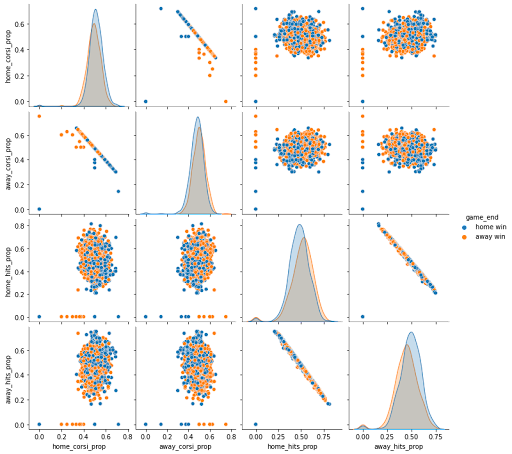
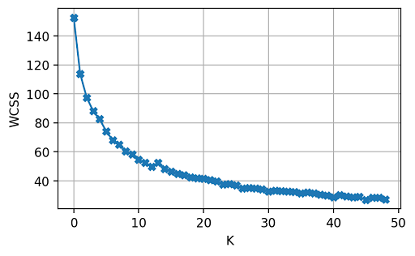
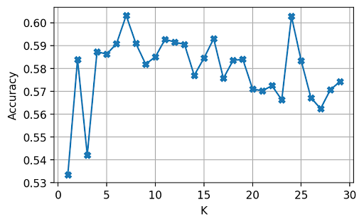
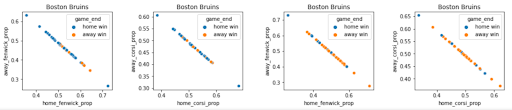
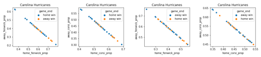
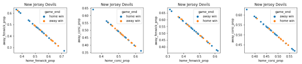
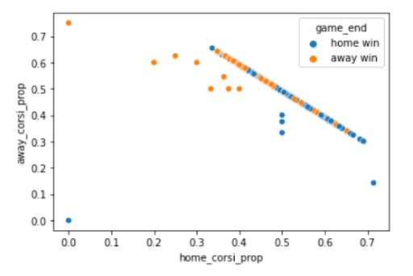
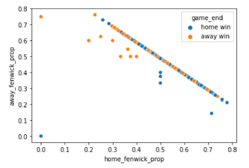
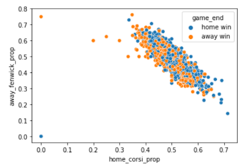
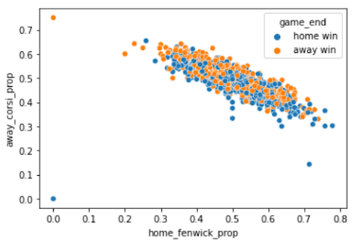

# HOCKEY GAME PREDICTION WITH SCRAPED NHL DATA
### Prepared by Matthew Keefer, Leroy Shaigarodsky, Alan Sourek, and Ceara Zhang
#### April 10, 2023

 

## Abstract
The purpose of this project aims to create a model to predict the outcomes of hockey games
using scraped data from the National Hockey League (NHL). The dataset contains a range of
categorical and numerical features related to team statistics, as well as game-specific information
such as date and location. The project employs three different modeling techniques: decision
tree, perceptron model, and k-means. The accuracy of the model is evaluated using
cross-validation techniques, and optimization is enhanced with hyperparameter tuning.
  
Users can visualize prediction information and accuracy as this framework supports 3 different
models: decision tree, k-means, and linear perceptron model. Through the process, it has been
concluded that hockey does keep to its claim as one of the hardest sports to predict, as accuracy
scores are falling as low as 47%. However, the results of this project can still potentially
contribute to practical applications in the sports industry, such as improving or informing team
strategies.

 

## Introduction
Ice hockey is a popular sport played worldwide with a large and passionate fan base. With the
growing availability of data, advanced statistical modeling techniques have become increasingly
popular in predicting game outcomes. The goals of this project are to explore exactly that; use
machine learning algorithms to predict the outcome of National Hockey League (NHL) games
using historical game data. The data originates from the NHL game data through a python library
API called nhlstats. This library draws directly from the raw NHL API, making it one of the
most robust ways to collect hockey information, simplifying data collection.
  
What this did mean, however, is that initial data construction needed to be crafty, since the data
dataset needed to be created using the api. This came from the following two api methods:
list_games and list_plays. The first method gets all games from a given season, while the second
gets all the plays for an individual game (shots, scores, penalties, takeaways, etc.).

 

## Background
In the initial research, it has been discovered that there were multiple prior attempts to predict a
future NHL game outcome using ML models. In the first research article written by Gianni
Pischedda, it is mentioned that past models have reached accuracies of 74.33% in NBA
predictions, 74-75% in NCAAB predictions, 75% in 2006 World Cup predictions, and 78.6% in
NFL predictions using neural networks and other ML models. However, the article predicts that
the best NHL predictors can only reach an accuracy of around 60% (Pischedda 1). After creating
a decision tree model and artificial neural network model, accuracies up to 57.67% and 59.17%
respectively were reached. Using ClusteR, a software to analyze sports, an accuracy of 61.54%
was reached, seemingly confirming this upper limit prediction of about 60% accuracy (Pischedda
4). Interestingly, there is approximately a 15% difference in prediction accuracy between NHL
games and many other sporting events, something we plan to explore further.
  
The second article written by Colton Barger attempts to create models to predict NHL outcomes
and explain why predictions are more difficult for the NHL than other sports. Barger creates
models using logistic regression, random forest classification, and linear SVM using rolling
statistics for teams from previous games including points, goals, goals against, power play
percentage, penalty kill percentage, shots on goal, shots against, faceoff win percentage, and save
percentage over different periods of time (Barger). The maximum accuracy he achieved with his
models was 57.39% with a logistic regression model which he attributes to the low-scoring
nature of hockey and volatile nature of games with respect to prior play (Barger).
  
After reviewing these articles, we decided to see if we can improve upon this accuracy threshold
of around 60% using models we have explored in class.

 

## Framework
### Data & Pre-Processing
The data used is a data frame table consisting of 15 columns. These columns are as follows:
Home team, Away team, proportion of shots a team made (home and away), proportion of
actions with corsi (home and away), proportion of actions with fenwick (home and away),
proportion of penalties (home and away), proportion of hits (home and away), proportion of
takeaways (home and away), and finally our class column, which determines if a game was a
home win or an away win. Corsi and fenwick are both advanced metrics which are defined in the analysis section.
 
### Methods
For feature selection, a variety of game time metrics were considered as these would relate to
gametime performance. While there were a lot of event types to choose from, some were not
significant in contributing to the outcome of the game, or were more narrow and focused on
helping specific actions in a game. Below are the methods used in this project’s framework:
 
##### Decision Tree
The initial machine learning model utilized in this research was the decision tree. The
model was selected due to its ability to identify patterns and relationships in the data,
which was not assumed to be linear or polynomial in nature. It was hypothesized that the
decision tree's nodes would efficiently split the dataset into suitable leafs to yield accurate
predictions.
 
##### Hyperparameter Tuning
In terms of hyperparameter tuning methods, standard approaches were used as taught in
class. For each model, a range of values to test was constructed and subsequently looped
through to compare result scores. For the decision tree model, tuning was done by
varying the criterion (gini or entropy), maximum depth, minimum instances, and target
impurity.
 
##### K-Means
The k-means algorithm was employed as another machine learning model, with the
intention of identifying clusters of similar results based on chosen features. After
analyzing the data using a pair plot, the possibility of clustering with respect to corsi
(home and away) and proportion of hits (home and away) was observed. This led to the
belief that k-means would be a promising model for predicting game outcomes using
these features. A pair plot depicting these features was generated and can be found in
Figure 1. The standard 10-fold validation was utilized during the training process to
determine the best combination of hyperparameters. In addition, when applicable, the
dataset was further split into roughly 75-25 train-validation / test sets.
  
To visualize the distance of nodes from centroids in each cluster based on the number of
clusters, an elbow plot was generated using WCSS vs. K (Figure 2). The optimal k-value
was then determined using 10-fold cross-validation and accuracy comparison. The results
indicated that the best cross-validated accuracy was obtained with k-values 7 and 24. A
graph showing the accuracy vs. k-value is shown below in Figure 3. The maximum
accuracy was achieved in predicting classifications for the test data using k = 24 at
62.28%.
 
###### Figure 1. Data Clustering

 
##### Perceptron Model
The perceptron model was used to find the best linear model for classifying and
predicting hockey games using all of the features in the dataset. The binary classification
iteratively learns the weights of the input features to classify as win or loss for the hockey
games. Based on this perceptron model, features with the highest weight in predicting
game outcomes were home team, home takeaways proportion, and and away hits
proportion. Accuracies for this model ranged between 47% and 53%.

 

## Analysis
Hockey, unlike baseball, lacks advanced analytics tools, and only a limited number of statistics
have been developed thus far, with corsi and fenwick being the two of the main features in the
models. Corsi is defined as the shot attempts for divided by the shot attempts against, regardless
of whether an individual shot is on target. Fenwick is similar to corsi, except it does not include
blocked shots, only shots on goal and missed shots. Our research explored the effectiveness of
different machine learning algorithms in predicting hockey game outcomes.
  
The Decision Tree model yielded an accuracy of approximately 58.8% on the dataset, using a
similar version of Decision Tree as in class. A feature simplification was attempted to reduce
modal run time, resulting in optimal hyperparameters of Gini Impurity as the criterion metric, a
max depth of 10, 3 minimum instances, and a target impurity of 0.14. The implementation of
bagging on the data increased accuracy only slightly, resulting in an accuracy of 59.92%, albeit
with a significantly increased runtime.
  
An accuracy of approximately 58% was achieved with the k-means model, with the maximum
accuracy of 62.28% obtained on the test data when using a k-value of 24, as shown in Figure 3.
The features used in this model were corsi (home and away) and proportion of hits (home and
away), as they demonstrated strong clustering during the initial analysis. This result is significant
because, as stated in the background, hockey predictors typically only achieve up to 60%
accuracy.
 
###### Figure 2. WCSS vs. K for K-Means Model

###### Figure 3. Cross Validation Accuracy vs. K for K-Means Model

 
In the linear perceptron model, the highest accuracy that was attainable was 53% using all of the
features in the dataset. The weight vector was weighed heaviest on the home team, home
takeaways proportion, and away hits attributes. This model scored the lowest accuracy rate out of
all the models used, indicating that the sport hockey does not have a very linear relationship, as
expected.
  
In addition to the models, several visualizations were constructed to obtain a more in depth look
at the individual statistics and to determine if they indicate a game’s result. The current three best
teams in terms of points accumulated across the entire league were chosen, and each of these
teams’ games were separated into comparisons of home_fenwick vs away_fenwick and
home_corsi vs away_corsi for home games, and home_fenwick vs away_fenwick and
home_corsi vs away_corsi for away games, respectively, as seen in Figure 4a, Figure 4b and
Figure 4c.
 
###### Figure 4a. Boston Bruins fenwick and corsi comparisons

###### Figure 4b. Carolina Hurricanes fenwick and corsi comparisons

###### Figure 4c. New Jersey Devils fenwick and corsi comparisons

 
As seen in the home game comparisons for the Bruins, Hurricanes and Devils, the more shooting
attempts that the away team creates, the more likely the game will end in a result for the home
team. However, taking a closer look at the Devils’ home_fenwick vs away_fenwick and
home_corsi vs away_corsi comparisons explains the key difference between the definitions of
corsi and fenwick.
  
Since fenwick and corsi are ratio statistics–fenwicks and corsis are inversely proportional for
opposing teams–more shots will lead to a higher corsi but not necessarily a higher fenwick. All
in all, there is a massive gap between the first set of points in the corsi plot, which is a result of
the Devils being more efficient than their opponents when it comes to goal scoring opportunities.
Consequently, despite having somewhat middling corsi stats compared to the Bruins and
Hurricanes, the Devils have better shots on goal at home, likely due to the crowd.
  
Similarly, looking at the away games for the Bruins, Hurricanes and Devils, leads to the
conclusion that efficiency wins hockey games, which is easier said than done. But, unlike home
games, there is not as much of a correlation between away_fenwick scores and away_wins; there
is likely a large element of either luck or the home crowd playing into the best teams’ away
performances.
  
League wide fenwick and corsi are represented by Figure 5a, Figure 5b, Figure 5c and Figure 5d
which represent NHL home_corsi vs away_corsi, home_fenwick vs away_fenwick, home_corsi
vs away_fenwick and home_fenwick vs away_corsi, respectively. Figure 5a and Figure 5b both
provide the same conclusion: the more shots and shots on goal that a team has, the higher
likelihood it has of winning the game. There isn’t a direct correlation between the amount of
shots that a team takes and winning the game, but based on Figure 5a and Figure 5b, there is a
general correlation between taking more shots and winning more games, which doesn’t directly
contradict or support the findings for the Bruins, Hurricanes and Devils discussed prior. Pairing
the two conclusions together results in the conclusion that the best teams are more efficient at
scoring their opportunities, whereas the teams who accumulate less points don’t create as many
high probability scoring chances.
 
###### Figure 5a. NHL home_corsi vs. away_corsi

###### Figure 5b. NHL home_fenwick vs. away_fenwick

 
Figure 5c and Figure 5d do not lead to as direct a conclusion as Figure 5a and Figure 5b. Figure
5c represents the home_corsi vs away_fenwick scores for the entire league, or in other words, the
home team’s total shots against the away team’s shots on target. The clustered area doesn’t back
any results but the few points on both ends of the cluster support the conclusion that more
efficient away teams win more away games. Figure 5d, also seems to lead to the conclusion that
despite an away team taking more shots, a more efficient home team will likely win the game.
 
###### Figure 5c. NHL home_corsi vs. away_fenwick

###### Figure 5d. NHL home_fenwick vs. away_corsi

 

## Conclusion
In conclusion, just as the research indicated, hockey is an incredibly tough sport to predict. Not
only is there currently a lack of statistics to use for prediction models, unlike baseball, but the
versatility of hockey, high intensity of the games and lack of crowd factor measurements makes
predicting hockey results all that much tougher.
  
Nonetheless, our models returned predictions with accuracies of 59.92% using a decision tree,
62.28% using k-means and 53% using a perceptron model. All of these scores are higher than
50%, which would be the equivalency to guessing an individual hockey game’s winning team
and more importantly, of our three models, one achieved an accuracy higher than the
pre-established goal of 60%, one achieved an accuracy of almost exactly 60%, and one achieved
an accuracy of slightly lower than 60%.
  
Corsi was the feature with the largest indication of a team’s probability of winning a given game,
as supported by figures 4a, 4b, 4c, 5a, 5c and 5d. There is likely a strong, yet hidden correlation
between fenwick and winning a game. Figures 4a, 4b, 4c, 5b, 5c and 5d all emphasize the
importance of efficiency in front of the net, or the need to put away goal scoring opportunities.
  
Future steps would likely involve the creation or extension of statistics, such as average time
between each stoppage of play or time between each goal, more specifically, or even a crowd
factor. In addition, for the k-means model, the k can be narrowed down to the range of four to 25,
as the best accuracies resulted in that range. Finally, one issue that likely lowered the accuracy
level was that of shootouts. Shootouts occur only when two teams are inseparable through
regulation and overtime, and at that point, statistics from the game are irrelevant. Consequently,
creating a new predictor for if a game reaches OT and/or a shootout would likely improve scores
all around.

 

## References
Barger, Colton. “Trying to Predict NHL Game Outcomes with ML and Why It’s Difficult.” Medium, 2022, https://medium.com/codex/trying-to-predict-nhl-game-outcomes-with-ml-and-why-its-difficult-aaac4d2a690b.
  
Pischedda, Gianni. “Predicting NHL Match Outcomes with ML Models.” International Journal of Computer Applications, vol. 101, no. 9, 2014, pp. 15-22. http://dx.doi.org/10.5120/17714-8249.
  
Lee, Christian. “Advanced Hockey Stats 101: Corsi (Part 1 of 4).” Medium, Hockey Stats, 30 Nov. 2020, https://medium.com/hockey-stats/advanced-hockey-stats-101-corsi-part-1-of-4-29d0a9fb1f95.
  
Lee, Christian. “Advanced Hockey Stats 101: Fenwick (Part 2 of 4).” Medium, Hockey Stats, 31 Dec. 2020, https://medium.com/hockey-stats/advanced-hockey-stats-101-fenwick-part-2-of-4-a8796b8188d.

